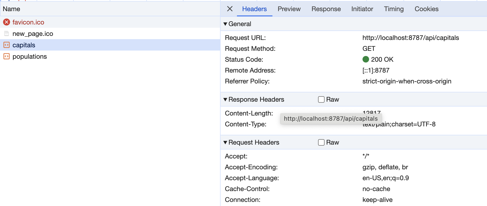

> [!NOTE]
> View the deployed example [here](https://pages-functions-countries-demo.pages.dev/). The description below does not go into detail as to how the front end code works; it focuses on the process of creating API endpoints. 

# Building a JSON API using Cloudflare Pages Functions

This demo uses a JSON API created using Cloudflare Functions to call the Countries API from Sample APIs, transform the response data, and send the result to the client using a custom endpoint.

Creating a JSON API using Cloudflare Pages Functions has several advantages, including: 

1. **Easy integration with Cloudflare Pages**: With Functions, you can create a lightweight serverless API that lives alongside your front-end code without the overhead of deploying it to a server or separate cloud platform.
2. **Data privacy**: Using a Cloudflare Pages API makes it easier to hide potentially sensitive backend resources such as URLs, private credentials, access tokens, and other information that shouldn't be exposed to the client. 
3. **Scalability/flexibility**: Adding a new endpoint is as simple as creating a new file. 


> [!CAUTION]
> Please note that the response of any network request sent from the client side will **ALWAYS** be visible in the browser's developer tools. The main advantage of setting up a JSON API is that the details of the request itself (access tokens, database credentials or other sensitive information) are hidden from the client. 

## 0. Development Environment Setup 

In order to develop with Pages Functions locally, you need to do a bit of setup. 

1. First, install Wrangler, which is a tool for locally developing Cloudflare Pages Functions and Workers: 

`npm i --save-dev wrangler` 

2. Next we need a way to start a local Wrangler development server and simultaneously serve our React app. This will ensure that the API endpoints we create are accessible to the app's front end while developing. If you just run your development command without also starting up a Wrangler development server, you will not be able to test your endpoints or use them in your app. 

I have modified the `dev` run script in my `package.json` as follows: `wrangler pages dev -- vite`. This starts up a Wrangler development server (`wrangler pages dev`) and then launches a Vite development server (`vite`). You could also create a separate run script or run the command directly on the command line. If you were using Create-React-App this would look something like `wrangler pages dev -- react-scripts start`.  

3. In the root of your project, create a file called `.dev.vars`. This file will contain any environment variables or secrets that need to be ingested by your Pages Functions. Generally this file should be added to your .gitignore, but it has been left in this example so you can see it. Environment variables should be added to this file one by one, one on each line  


## 1. API Setup

At the root of your project, take notice of the folder called `functions` (it **must** be named `functions` or none of this will work). Inside of it you will see a subdirectory called `/api`. This subdirectory will contain the code for our API endpoints, each of which will live in a separate file. 

Within your `/api` subdirectory, there are two files: `capitals.ts` and `populations.ts` (the examples are written in TypeScript but you can obviously use plain `.js` files). Each represents a separate API endpoint for our app. Note that **the file name will become the name of the endpoint** (for example, `api/capitals` and `api/populations`) so stick with something concise and descriptive. 

# 2. Building our Endpoints

Let's look at `functions/api/capitals.ts`. Suppose we want to create an endpoint that calls the Countries API from Sample APIs and return a filtered array made up of the names of countries and their capital cities.  


```javascript
export async function onRequestGet({ env }) {

  const { API_ENDPOINT: url } = env;
  const res = await fetch(url);
  const countries = await res.json();
  const capitals = countries.map(({ name, capital, id }) => ({ name, capital, id }));

  return new Response(JSON.stringify(capitals));
}
```

1. Every GET endpoint must export a function called `onRequestGet`. This function is basically called every time the endpoint receives a new request. It receives an object called `EventContext` which has several properties, including `env`. `env` represents the environment variables and secrets for the request. 

> [!IMPORTANT]
> In development, your environment variables live inside your `.dev.vars` file. When deploying to Cloudflare, your environment variables will be pulled from the "Environment Variables" section of the Cloudflare Pages dashboard for your app.

2. We destructure a property called `API_ENDPOINT` from the `env` object. Again, `env` here represents all of the environment variables listed in your `.dev.vars` file (in development) or under Settings > Environment Variables within your Pages project on the Cloudflare dashboard. Notice in the example `.dev.vars` file, the variable `API_ENDPOINT` contains the URL from the Countries API from Sample APIs. We store this as an environment variable so that we can call it from the backend without directly exposing the URL to the client.

3. After fetching the data from the Countries API, we create a new array of objects with just the `name`, `capital`, and country `id` of each country. 

4. We return the new object in a `new Response`. The data must be `JSON.stringify`ed before sending it; otherwise you will see the text "[object Object]" when you try to access the endpoint.

If you run `npm pages dev`, the Wrangler server will start up as will the Vite development server. Now, if you go to `http://localhost:8787/api/capitals` in your browser (or if you send a request through CURL/Postman) you should see something like the following: 


Success! We repeat a similar pattern for `populations.ts`, except this time we pull the `population` property for each country, and then return an array of countries sorted by population in descending order. 

# 3. What's the Point?

We could have just called the Countries API from the front-end and then pulled out the properties we needed without the overhead of setting up serverless API endpoints
Correct. But imagine that instead of accessing a publicly available API, we needed to return data from a database or private API that required credentials to access. If we made the call from the front end, the credentials would be visible to anyone accessing our app via the Network tab in DevTools. By moving the call to the Countries API to the backend, we ensure that the only thing the user can access is the filtered, "curated" version of the data. They have no access to the underlying Countries API. 

Or if that's not convincing, imagine that each call to the Countries API returned 300MB worth of data - for example, let's say that a single object contained demographic information about every single administrative region of the country and its geometric information. If we only need a tiny subset of that data in the front end of our app, it would not make sense to burden the user's browser with such a huge network request. 

To test that only our endpoint is available to the user, and not the underlying Countries API, go to [http://localhost:8787](http://localhost:8787) (or wherever your app is running). Open the Network tab of your Developer Tools. Click "World Capitals" and then "World Populations" and wait for the requests to go through. You should see something like the below. You can verify that the only requests visible in the browser are the ones made to our Cloudflare Pages Functions API endpoints (`capitals` and `populations`). 




# 4. Additional Resources and Links

1. [Build an API for your front end using Pages Functions
](https://developers.cloudflare.com/pages/tutorials/build-an-api-with-pages-functions/)
2. [Pages Functions API Reference](https://developers.cloudflare.com/pages/functions/api-reference/)
3. [Functions Routing](https://developers.cloudflare.com/pages/functions/routing/)